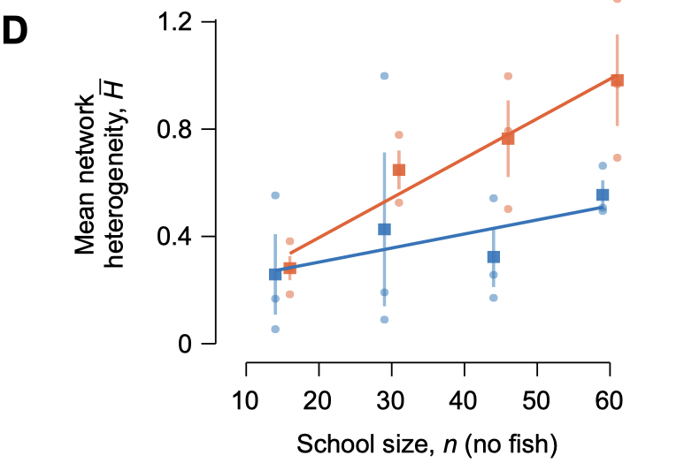

Beyond the guidelines for a particular journal, there are elements to designing figures the we have converged on over the years. Some of these are aesthetic choices, but most are simply good design ideas to minimize confusion on the part of the reader.

Offset axes are generally a good idea. They look like this:

Offset axes do not interfere with the data and make it easy to stack panels that share a common axis. Unfortunately, offset axes cannot be generated easily in Matlab (though it is possible in ggplot in R), so they have to be created manually in illustrator. This is usually done by modifying the existing axes.

The above screenshot highlights a surprising number of additional formatting items:

- Display all numbers along an axis with the same number of decimal places. So, if you have "0.6" and "0.8", then the number one should be "1.0" and not "1".
- Do not use minor ticks. 
- Have all ticks directed outward. 
- The text along the x-axis should be center-justified and the number should be distributed horizontally at a regular interval.
- The numbers along the y-axis should be right-justified, right-aligned, and vertically-distributed. 
- Axis labels should be centered along each axis.
- Stick with circles and squares (either filled or open) for symbol shapes. On rare occasions, triangles can be used as a last resort, but any other symbols clutter the graph and make it unclear where the data are centered. 
- We generally include the mathematical symbols along with the words for each quantity. Physical scientist want the symbol, biologists want the words, so we provide both.
- Transparency is a good way of generating monochromatic contrast. The error flags and individual measurements (the circles) are less critical than the trend line and mean values (squares). If everything where 100% opaque, then the more important items would be harder to see clearly. 
- Symbol sizes are an additional means of communicating their importance.
- The default thickness of lines is 0.5 pt. For example, that is the thickness of the axis lines. The trend lines are 1.0 pt, which offers emphasis.
- Journals differ in how they handle capitalization of axes and other text. JEB uses sentence case (e.g., "School size"), whereas the Royal Society journals use lower case ("school size"), and others use title case ("School Size"). So that's a factor to look for, in addition to whether the preferred font is serif (e.g., Times), or sans-serif(e.g., Arial).  Note have panel lettering is handled by the journal.

There are probably additional details that I am missing, which illustrates how few details of a paper's figures are determined arbitrarily.