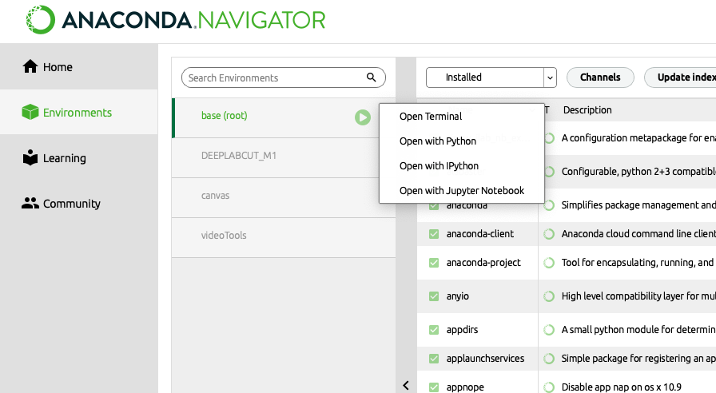
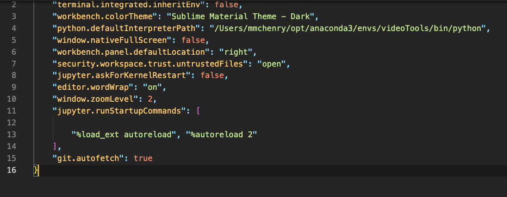
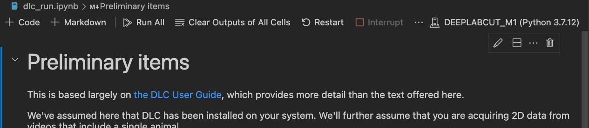

# Getting started with Python

Python is a popular scripting language in lots of areas of computing and has caught on as a popular open-source option for scientific data analysis.
Typical of open-source projects, there are myriad ways of developing and deploying your code. 
This is a guide for setting yourself up for coding in Python in a way that I have found to be flexible and powerful, yet not too challenging for the beginner.
This guide is merely intended point you towards tools to get started, but you'll want to look elsewhere on how to actually code in Python. 

Here are some excellent online resources for learning Python for scientific computing:

- [Python for Data Analysis](https://wesmckinney.com/book/)
- [Python for Scientific Computing](https://aaltoscicomp.github.io/python-for-scicomp/)

## Anaconda 

In its most basic version, Python is not particularly useful for scientific computing, but that functionality transforms through the installation of packages. 
[Anaconda](https://www.anaconda.com) is a distribution of Python that includes Python along with some of the most popular and useful packages for scientific computing. 
For example, Anaconda includes the packages 'Numpy', for mathematical operations, 'Pandas', for organizing data, and 'Matplotlib', for visualizing data. Anaconda is easy to install for MacOS, Windows, or Linux from their [website](https://www.anaconda.com) and we will henceforth assume that you have performed that installation. Once installed, the Anaconda-Navigator provides a GUI gateway for python tools.

## Environments

Open-source software frequently draws on code from other packages. For example, Pandas uses Numpy as a basis for calculations that are performed upon a tabulated organization of data. As a consequence, updates to one package can introduce errors when called by a package that was assuming an earlier version of the code. These dependencies between packages can become a nightmare to maintain if you are running different code that assumes a variety of versions of the same package. 

Environments provide a means to manage versions of packages that are compatible with one-another. When you run python code within a particular environment, it uses a specific  version of the python interpreter and versions of the packages that have been explicity installed. Anaconda comes with a 'base' environment and if you browse to that in the Anaconda Navigator, then you can see all of the packages and their version number included in the base installation. It's a good idea to create a new environment for a new coding project to start with a clean slate and to keep from disrupting any other projects.

Here is the Anaconda GUI's area for navigating environments:

Instead of the Anaconda GUI, there are different programs for installing and managing packages within an environment using commands within a terminal window. Anaconda uses the 'Conda' package manager by default. 'pip' is another one.

You may enter an environment at the command line:

    conda activate <env name>

Where \<env name\> corresponds to the title of the DLC environment (e.g., DEEPLABCUT).
If you are not a terminal user, then you don't need to bother with that now.

## VS Code

Microsoft's Visual Studio Code (VS Code) is a text editor that you can expand into a full Integrated Development Environment (IDE). 
This means that you can use VS Code to compose and run code. 
VS Code's functionality expands through the installation of extensions. 

Start by downloading an installing VS Code from [here](https://code.visualstudio.com).

Launch the program and click on the Extensions tab on the left. Then search for, and install, the following extensions:

1. Python (Microsoft).
1. Jupyter (Microsoft).
1. GitHub Copilot

These are optional, but I have found them helpful:

1. Code Spell Checker
1. ToDo Tree

Python has a quirk where you have to restart the kernel (i.e. the program) to load updated code. To make it so the package you might be developing reloads each time you save it, then I also recommend doing the following:

1. Open Settings in VS Code
1. Search for 'jupyter runstart' and then click on the link to edit 'settings.json'
1. Edit the settings to include the following: 

    "jupyter.runStartupCommands": [
    "%load_ext autoreload", "%autoreload 2"
],

The json file should look something like this:

When running code in VS Code, you'll want to specify that you will be running it in your DLC environment, which should be an option in the upper right corner of the window when you open a .py or .ipynb file, like this:

 

## Autoreload (not through VS Code)

If you are using another IDE, you can get python to autoreload as you are developing a module, as explained [here](https://stackoverflow.com/questions/35037815/how-to-automatically-reload-modules-in-ipython).

## Github

[Github](https://github.com) is a Source Control Provider (SCP), which is a cloud service for hosting code using the Git version control system. 
To use it, you will first need to create a github account.
Access to GitHub's educational license, called the [GitHub Global Campus](https://education.github.com/discount_requests/pack_application) is necessary for Pro-level features and access to Copilot, so provide your credentials to get access to that license.

You will also need both low-level code and a client app on your computer.
The low-level code for git is installed on MacOS and Linux, but not Windows.
There's lots to learn about the workings of git and the use of Github, but for the moment think of it as a means of distributing code, even if it's just for people in your lab. 
 Note that VS Code has an integrated 'Source Control' tab on the left-hand pallet for managing code via GitHub. 
 

## Github Copilot

This service, developed by OpenAI, allows for the generation of code in plain language. 
It is by no means flawless and will still require learning some coding basics to make it useful.
Nonetheless, Copilot can be a huge timesaver and is certainly worth using as you learn the ropes on Python. 
Members of the Github Global Campus [are eligible](https://github.blog/2022-09-08-github-copilot-now-available-for-teachers/) and it is integrated into VS Code. 
